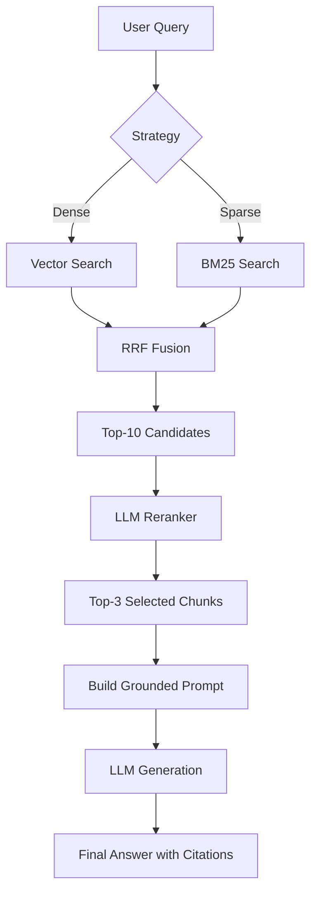

# Architecture — RAG Pipeline (Day 08 Lab)

## 1. Tổng quan kiến trúc

```
[Raw Docs]
    ↓
[index.py: Preprocess → Chunk → Embed → Store]
    ↓
[ChromaDB Vector Store]
    ↓
[rag_answer.py: Query → Retrieve → Rerank → Generate]
    ↓
[Grounded Answer + Citation]
```

**Mô tả ngắn gọn:**
Hệ thống là một trợ lý nội bộ hỗ trợ khối CS và IT Helpdesk tra cứu quy trình, chính sách công ty. Hệ thống sử dụng kiến trúc RAG (Retrieval-Augmented Generation) để đảm bảo câu trả lời có tính xác thực cao (grounded) và có trích dẫn nguồn (citation).

---

## 2. Indexing Pipeline (Sprint 1)

### Tài liệu được index
| File | Nguồn | Department | Số chunk |
|------|-------|-----------|---------|
| `policy_refund_v4.txt` | policy/refund-v4.pdf | CS | 8 |
| `sla_p1_2026.txt` | support/sla-p1-2026.pdf | IT | 10 |
| `access_control_sop.txt` | it/access-control-sop.md | IT Security | 11 |
| `it_helpdesk_faq.txt` | support/helpdesk-faq.md | IT | 5 |
| `hr_leave_policy.txt` | hr/leave-policy-2026.pdf | HR | 5 |

*Tổng cộng: 39 chunks.*

### Quyết định chunking
| Tham số | Giá trị | Lý do |
|---------|---------|-------|
| Chunk size | 400 characters (~100 tokens) | Phù hợp với các điều khoản chính sách ngắn, súc tích. |
| Overlap | 80 characters | Duy trì ngữ cảnh giữa các đoạn điều khoản bị cắt ngang. |
| Chunking strategy | Section-based | Cắt theo heading `=== Section ===` để giữ tính toàn vẹn của một điều mục. |
| Metadata fields | source, section, effective_date, department, access | Phục vụ filter, freshness, citation. |

### Embedding model
- **Model**: OpenAI `text-embedding-3-small` (Configurable via ENV)
- **Vector store**: ChromaDB (PersistentClient)
- **Similarity metric**: Cosine Similarity

---

## 3. Retrieval Pipeline (Sprint 2 + 3)

### Baseline (Sprint 2)
| Tham số | Giá trị |
|---------|---------|
| Strategy | Dense (embedding similarity) |
| Top-k search | 10 |
| Top-k select | 3 |
| Rerank | Không |

### Variant (Sprint 3)
| Tham số | Giá trị | Thay đổi so với baseline |
|---------|---------|------------------------|
| Strategy | Hybrid (Dense + Sparse) | Thêm BM25 Keyword Matching qua RRF fusion. |
| Top-k search | 10 | Giữ nguyên. |
| Top-k select | 3 | Giữ nguyên. |
| Rerank | LLM-based Rerank | Thêm bước LLM chọn top 3 relevant nhất từ top 10. |

**Lý do chọn variant này:**
Corpus có chứa nhiều mã lỗi kỹ thuật (ERR-403) và tên quy trình chính xác (SLA P1). Hybrid giúp bắt đúng keyword, trong khi LLM Reranking giúp chọn đúng semantic context khi có nhiều đoạn văn bản trông tương tự nhau.

---

## 4. Generation (Sprint 2)

### Grounded Prompt Template
```
Answer only from the retrieved context below.
If the context is insufficient, say you do not know.
Cite the source field when possible.
Keep your answer short, clear, and factual.

Question: {query}

Context:
[1] {source} | {section} | score={score}
{chunk_text}

Answer:
```

### LLM Configuration
| Tham số | Giá trị |
|---------|---------|
| Model | `gpt-4o-mini` / `gemini-2.5-flash` |
| Temperature | 0 (để output ổn định cho eval) |
| Max tokens | 512 |

---

## 5. Failure Mode Checklist

| Failure Mode | Triệu chứng | Cách kiểm tra |
|-------------|-------------|---------------|
| Index lỗi | Retrieve về docs cũ / sai version | `inspect_metadata_coverage()` trong index.py |
| Chunking tệ | Chunk cắt giữa điều khoản | `list_chunks()` và đọc text preview |
| Retrieval lỗi | Không tìm được expected source | `score_context_recall()` trong eval.py |
| Generation lỗi | Answer không grounded / bịa | `score_faithfulness()` trong eval.py |
| Token overload | Context quá dài → lost in the middle | Kiểm tra độ dài context_block |

---

## 6. Diagram

